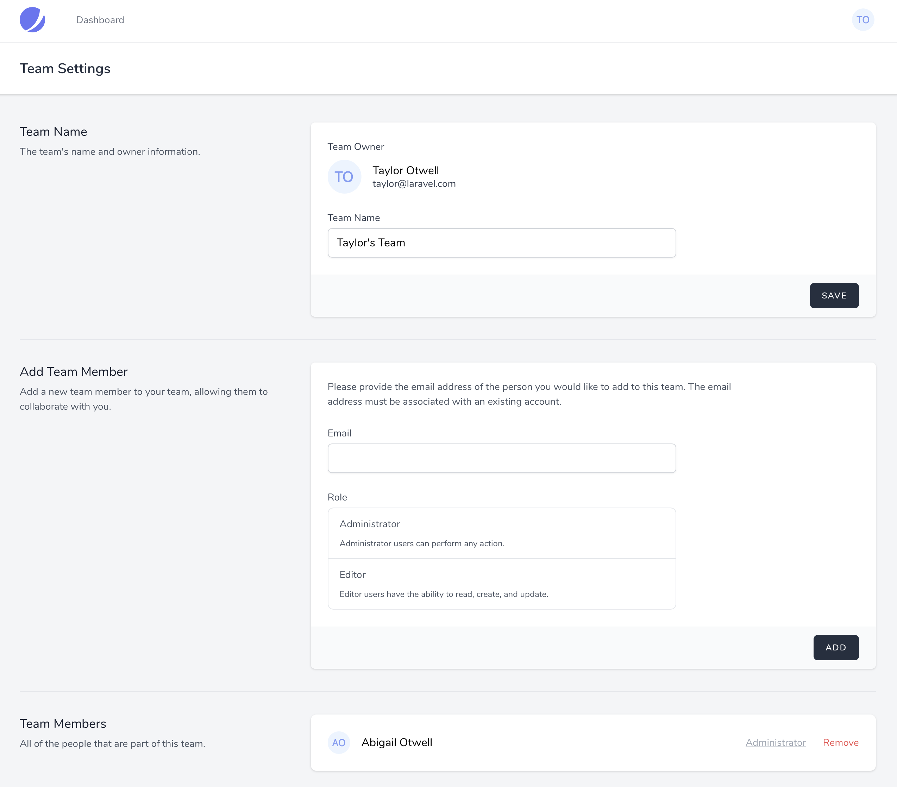
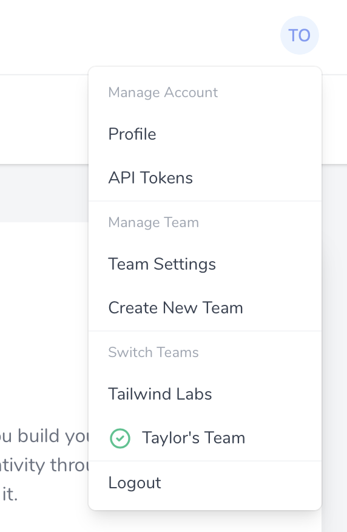

# Teams

[[toc]]

## Introduction

If you installed Jetstream using the `--teams` option, your application will be scaffolded to support team creation and management.

Jetstream's team features allow each registered user to create and belong to multiple teams. By default, every registered user will belong to a "Personal" team. For example, if a user named "Sally Jones" creates a new account, they will be assigned to a team named `Sally's Team`. After registration, the user may rename this team or create additional teams.



:::warning Jetstream Teams

Jetstream's team scaffolding and opinions may not work for every application. If it doesn't work for your use case, feel free to create a non-team based Jetstream application and add team functionality to your application yourself.
:::

## Team Creation / Deletion

The team creation view is accessed via the top-right user navigation dropdown menu.

### Views / Pages

When using the Livewire stack, the team creation view is displayed using the `resources/views/teams/create-team-form.blade.php` Blade template. When using the Inertia stack, this view is displayed using the `resources/js/Pages/Teams/CreateTeamForm.vue` template.

### Actions

Team creation and deletion logic may be customized by modifying the relevant action classes within your `app/Actions/Jetstream` directory. These actions include `CreateTeam`, `UpdateTeamName`, and `DeleteTeam`. Each of these actions is invoked when their corresponding task is performed by the user in the application's UI. You are free to modify these actions as needed based on your application's needs.

Execute code when a Team is created / deleted from the web interface or through Team class API.

When a Team is created either from the web interface of Jetstream or through a REST API call directly, it is required sometimes to execute some initialization code. For example, populate a units_of_measure table with default values for the new Team.

Adding a boot() function inside the Team.php class you can execute initialization code when a Team is created or deleted

```php
class Team extends JetstreamTeam
{
    protected static function boot()
    {
        parent::boot();

        Team::created(function ($model) {
            UnitOfMeasureController::insert_default_units_of_measure_data($model);
        });
    }
  } //Team.php class
```

## Inspecting User Teams

Information about a user's teams may be accessed via the methods provided by the `Laravel\Jetstream\HasTeams` trait. This trait is automatically applied to your application's `App\Models\User` model during Jetstream's installation. This trait provides a variety of helpful methods that allow you to inspect a user's teams:

```php
// Access a user's currently selected team...
$user->currentTeam : Laravel\Jetstream\Team

// Access all of the team's (including owned teams) that a user belongs to...
$user->allTeams() : Illuminate\Support\Collection

// Access all of a user's owned teams...
$user->ownedTeams : Illuminate\Database\Eloquent\Collection

// Access all of the teams that a user belongs to but does not own...
$user->teams : Illuminate\Database\Eloquent\Collection

// Access a user's "personal" team...
$user->personalTeam() : Laravel\Jetstream\Team

// Determine if a user owns a given team...
$user->ownsTeam($team) : bool

// Determine if a user belongs to a given team...
$user->belongsToTeam($team) : bool

// Get the role that the user is assigned on the team...
$user->teamRole($team) : \Laravel\Jetstream\Role

// Determine if the user has the given role on the given team...
$user->hasTeamRole($team, 'admin') : bool

// Access an array of all permissions a user has for a given team...
$user->teamPermissions($team) : array

// Determine if a user has a given team permission...
$user->hasTeamPermission($team, 'server:create') : bool

// Delete a Team and detach related users
$team->purge()
```

### Current Team

Every user within a Jetstream application has a "current team". This is the team that the user is actively viewing resources for. For example, if you are building a calendar application, your application would display the upcoming calendar events for the user's current team.

You may access the user's current team using the `$user->currentTeam` Eloquent relationship. This team may be used to scope your other Eloquent queries by the team:

```php
return App\Models\Calendar::where(
    'team_id', $request->user()->currentTeam->id
)->get();
```

A user may switch their current team via the user profile dropdown menu available within the Jetstream navigation bar.



### The Team Object

The team object that is accessed via `$user->currentTeam` or via Eloquent queries provides a variety of useful methods for inspecting the team's attributes and relationships:

```php
// Access the team's owner...
$team->owner : \App\Models\User

// Get all of the team's users, including the owner...
$team->allUsers() : Illuminate\Database\Eloquent\Collection

// Get all of the team's users, excluding the owner...
$team->users : Illuminate\Database\Eloquent\Collection

// Determine if the given user is a team member...
$team->hasUser($user) : bool

// Determine if the team has a member with the given email address...
$team->hasUserWithEmail($emailAddress) : bool

// Determine if the given user is a team member with the given permission...
$team->userHasPermission($user, $permission) : bool
```

## Member Management

Team members may be added and removed via Jetstream's "Team Settings" view. The backend logic that manages these actions may be customized by modifying the relevant actions, such as the `App\Actions\Jetstream\AddTeamMember` class.

### Member Management Views / Pages

When using the Livewire stack, the team member manager view is displayed using the `resources/views/teams/team-member-manager.blade.php` Blade template. When using the Inertia stack, this view is displayed using the `resources/js/Pages/Teams/TeamMemberManager.vue` template. Generally, these templates should not require customization.

### Member Management Actions

Team member addition logic may be customized by modifying the `App\Actions\Jetstream\AddTeamMember` action class. The class' `add` method is invoked with the currently authenticated user, the `Laravel\Jetstream\Team` instance, the email address of the user being added to the team, and the role (if applicable) of the user being added to the team.

This action is responsible for validating that the user can actually be added to the team and then adding the user to the team. You are free to customize this action based on the needs of your particular application.

### Roles / Permissions

Each team member added to a team may be assigned a given role, and each role is assigned a set of permissions. Role permissions are defined in your application's `JetstreamServiceProvider` using the `Jetstream::role` method. This method accepts a "slug" for the role, a user-friendly role name, the role permissions, and a description of the role. This information will be used to display the role within the team member management view:

```php
Jetstream::defaultApiTokenPermissions(['read']);

Jetstream::role('admin', 'Administrator', [
    'create',
    'read',
    'update',
    'delete',
])->description('Administrator users can perform any action.');

Jetstream::role('editor', 'Editor', [
    'read',
    'create',
    'update',
])->description('Editor users have the ability to read, create, and update.');
```

:::tip Team API Support

When Jetstream is installed with team support, available API permissions are automatically derived by combining all unique permissions available to roles. Therefore, a separate call to the `Jetstream::permissions` method is unnecessary.
:::

### Authorization

Of course, you will need a way to authorize that incoming requests initiated by a team member may actually be performed by that user. A user's team permissions may be inspected using the `hasTeamPermission` method available via the `Laravel\Jetstream\HasTeams` trait. There is never a need to inspect a user's role. You only need to inspect that the user has a given granular permission. Roles are simply a presentational concept used to group granular permissions. Typically, you will execute calls to this method within your application's [authorization policies](https://laravel.com/docs/authorization):

```php
if ($request->user()->hasTeamPermission($team, 'read')) {
    // The user's role includes the "read" permission...
}
```

#### Combining Team Permissions With API Permissions

When building a Jetstream application that provides both API support and team support, you should verify an incoming request's team permissions **and** API token permissions within your application's authorization policies. This is important because an API token may have the theoretical ability to perform an action while a user does not actually have that action granted to them via their team permissions:

```php
/**
 * Determine whether the user can view a flight.
 *
 * @param  \App\Models\User  $user
 * @param  \App\Models\Flight  $flight
 * @return bool
 */
public function view(User $user, Flight $flight)
{
    return $user->belongsToTeam($flight->team) &&
           $user->hasTeamPermission($flight->team, 'flight:view') &&
           $user->tokenCan('flight:view');
}
```
