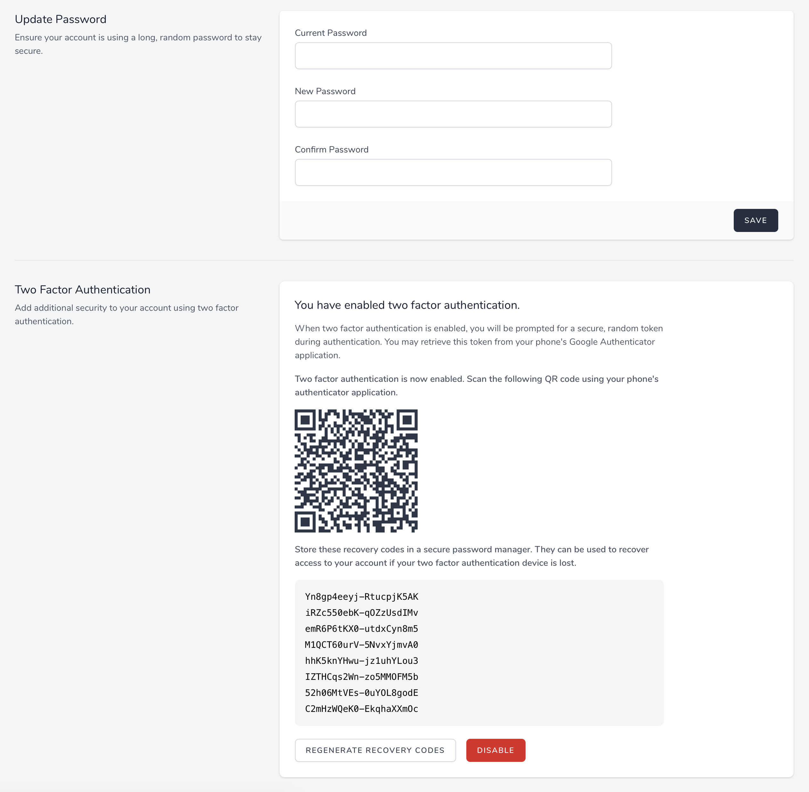

# Two Factor Authentication

[[toc]]

## Introduction

Laravel Jetstream automatically scaffolds two-factor authentication support for all Jetstream applications. Laravel Jetstream's security features are accessed by the user using the top-right user profile navigation dropdown menu. Within this dashboard, Jetstream scaffolds views that allow the user to enable and manage two-factor authentication for their account.

**When a user enables two-factor authentication for their account, they should scan the given QR code using a free TOTP authenticator application such as Google Authenticator. In addition, they should store the listed recovery codes in a secure password manager such as [1Password](https://1password.com).**

If the user loses access to their mobile device, the Jetstream login page will allow them to authenticate using one of their recovery codes instead of the temporary token provided by their mobile device's authenticator application.



## Actions

Most Jetstream features can be customized via action classes. However, for security, Jetstream's two-factor authentication services are encapsulated within Jetstream and should not require customization.

## Views / Pages

Typically, the two-factor authentication feature's corresponding views and pages should not require customization as they are already feature-complete. However, their locations are described below in case you need to make small presentation adjustments to these pages.

When using the Livewire stack, the two-factor authentication management view is displayed using the `resources/views/profile/two-factor-authentication-form.blade.php` Blade template. When using the Inertia stack, this view is displayed using the `resources/js/Pages/Profile/TwoFactorAuthenticationForm.vue` template.

## Disabling Two-Factor Authentication

If you would like, you may disable support for two-factor authentication by removing the feature from the `features` array of your application's `config/fortify.php` configuration file:

```php
use Laravel\Fortify\Features;

'features' => [
    Features::registration(),
    Features::resetPasswords(),
    Features::emailVerification(),
    Features::updateProfileInformation(),
    Features::updatePasswords(),
    // Features::twoFactorAuthentication([
    //     'confirmPassword' => true,
    // ]),
],
```
