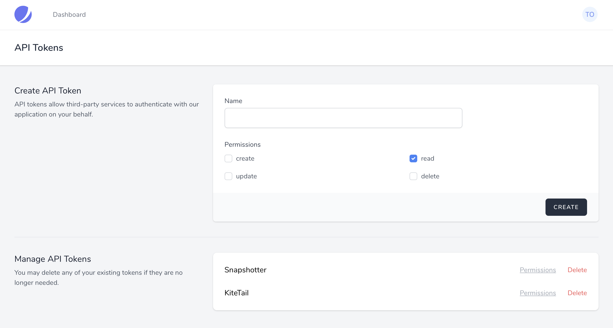

# API

[[toc]]

## Introduction

Jetstream includes first-party integration with [Laravel Sanctum](https://laravel.com/docs/sanctum). Laravel Sanctum provides a featherweight authentication system for SPAs (single page applications), mobile applications, and simple, token-based APIs. Sanctum allows each user of your application to generate multiple API tokens for their account. These tokens may be granted abilities / permissions which specify which actions the tokens are allowed to perform.



By default, the API token creation panel may be accessed using the "API" link of the top-right user profile dropdown menu. From this screen, users may create Sanctum API tokens that have various permissions.

:::tip Sanctum Documentation

For more information on Sanctum and to learn how to issue requests to a Sanctum authenticated API, please consult the official [Sanctum documentation](https://laravel.com/docs/sanctum).
:::

## Enabling API Support

If your application will be offering an API that may be consumed by third-parties, you must enable Jetstream's API feature. To do so, you should uncomment the relevant entry in the `features` configuration option of your application's `config/jetstream.php` configuration file:

```php
'features' => [
    Features::profilePhotos(),
    Features::api(),
    Features::teams(),
],
```

## Defining Permissions

The permissions available to API tokens are defined using the `Jetstream::permissions` method within your application's `App\Providers\JetstreamServiceProvider` class. Permissions are defined as simple strings. Once they have been defined they may be assigned to an API token:

```php
Jetstream::defaultApiTokenPermissions(['read']);

Jetstream::permissions([
    'post:create',
    'post:read',
    'post:update',
    'post:delete',
]);
```

The `defaultApiTokenPermissions` method in the example above may be used to specify which permissions should be selected by default when creating a new API token. Of course, a user may uncheck a default permission before creating the token.

## Authorizing Incoming Requests

Every request made to your Jetstream application, even to authenticated routes within your `routes/web.php` file, will be associated with a Sanctum token object. You may determine if the associated token has a given permission using the `tokenCan` method provided by the `Laravel\Sanctum\HasApiTokens` trait.

This `HasApiTokens` trait is automatically applied to your application's `App\Models\User` model during Jetstream's installation. Typically, you will call the `tokenCan` method within your application's controllers, Livewire components, or [authorization policies](https://laravel.com/docs/authorization#creating-policies):

```php
return $request->user()->id === $post->user_id &&
       $request->user()->tokenCan('post:update')
```

### First-Party UI Initiated Requests

When a user makes a request to a route within your `routes/web.php` file, the request will typically be authenticated by Sanctum through an authenticated session cookie based guard. In most Laravel applications, this is the `web` guard.

When the user is making a first-party request through the application UI, the `tokenCan` method will always return `true`. Remember, this does not necessarily mean that your application has to allow the user to perform the action. Typically, your policies will determine if the token has been granted permission to perform the abilities **as well as check that the user instance itself should be allowed to perform the action**.

For example, in the case of updating a blog post, this might mean checking that the token is authorized to update posts **and** that the post belongs to the user:

```php
return $request->user()->id === $post->user_id &&
       $request->user()->tokenCan('post:update')
```

At first, allowing the `tokenCan` method to be called and always return `true` for first-party UI-initiated requests may seem strange; however, it is convenient to be able to always assume an API token is available and can be inspected via the `tokenCan` method. This means that you may always call the `tokenCan` method within your application's authorization policies without worrying about whether the request was triggered from your application's UI or was initiated by one of your API's third-party consumers.
