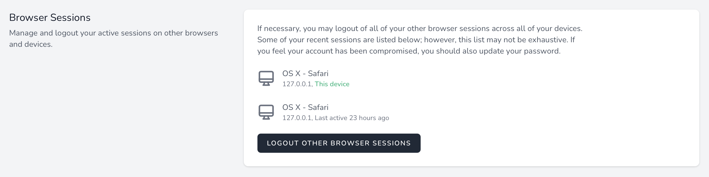

# Browser Sessions

[[toc]]

## Introduction

Laravel Jetstream's security features are accessed by the user using the top-right user profile navigation dropdown menu. Within this dashboard, Jetstream scaffolds views that allow the user to view the browser sessions associated with their account. In addition, the user may "logout" browser sessions other than the one being used by the device they are currently using.

This feature utilizes Laravel's built-in `Illuminate\Session\Middleware\AuthenticateSession` middleware to safely log out other browser sessions that are authenticated as the current user.

:::warning Session Driver

To utilize browser session management within Jetstream, ensure that your session configuration's `driver` (or `SESSION_DRIVER` environment variable) is set to 'database'.
:::

## Actions

Most Jetstream features can be customized via action classes. However, for security, Jetstream's browser session services are encapsulated within Jetstream and should not require customization.

## Views / Pages

Typically, the browser session feature's corresponding views and pages should not require customization as they are already feature-complete. However, their locations are described below in case you need to make small presentation adjustments to these pages.

When using the Livewire stack, the browser session management view is displayed using the `resources/views/profile/logout-other-browser-sessions-form.blade.php` Blade template. When using the Inertia stack, this view is displayed using the `resources/js/Pages/Profile/LogoutOtherBrowserSessionsForm.vue` template.
