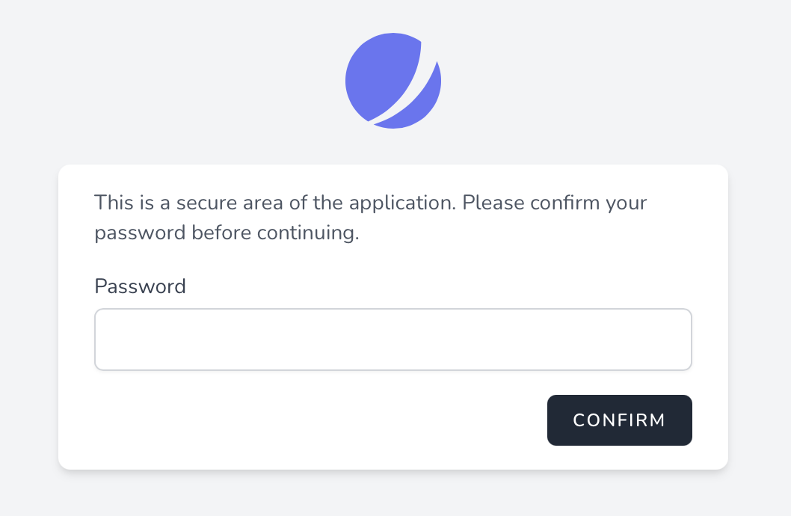

# Password Confirmation

[[toc]]

## Introduction

While building your application, you may occasionally have actions that should require the user to confirm their password before the action is performed. For example, Jetstream itself requires users to confirm their password before changing their two-factor authentication settings. Thankfully, Jetstream has built-in functionality to make this a cinch.

Jetstream provides two approaches to password confirmation: redirect based password confirmation and modal based password confirmation.

#### Redirect Based Password Confirmation

Redirect based password confirmation is typically used when the user needs to confirm their password before accessing an entire screen that is rendered by your application, such as a billing settings screen.

This form of password confirmation redirects the user to a dedicated password confirmation screen where they must confirm their password before being redirected to their intended destination.

#### Modal Based Password Confirmation

Modal based password authentication might be used when you would like the user to confirm their password before performing a specific action, such as when enabling two-factor authentication.

This form of password confirmation displays a modal window that allows the user to confirm their password before their intended request is executed.

## Redirect Password Confirmation

The following documentation will discuss how to use redirect based password confirmation in Jetstream. Redirect based password confirmation is typically used when the user needs to confirm their password before accessing an entire screen that is rendered by your application, such as a billing settings screen.

This form of password confirmation redirects the user to a dedicated password confirmation screen where they must confirm their password before being redirected to their intended destination.



### Redirect Password Confirmation Via Livewire

#### Protecting Routes

To implement password confirmation via redirect to a password confirmation screen, you should ensure that the route that will render the view that requires password confirmation and any routes that perform the confirmed actions are assigned the `password.confirm` middleware.

This middleware is included with the default installation of Laravel and will ensure that the user is redirected to your application's password confirmation screen if they attempt to access the routes without confirming their password:

```php
Route::get('/billing', function () {
    // ...
})->middleware(['password.confirm']);

Route::post('/billing', function () {
    // ...
})->middleware(['password.confirm']);
```

That view that renders the Livewire stack's password confirmation screen is located at `resources/views/auth/confirm-password.blade.php`. Generally, this view should not need customization; however, you are free to make general presentational tweaks to this page based on your own application's design.

#### Ensuring The Password Has Been Confirmed

Next, Livewire components that contain an action that should require password confirmation before being invoked should use the `Laravel\Jetstream\ConfirmsPasswords` trait.

After adding this trait to a component, you should call the `ensurePasswordIsConfirmed` method within any Livewire action that requires password confirmation. This should be done at the very beginning of the relevant action method:

```php
/**
 * Enable administration mode for user.
 *
 * @return void
 */
public function enableAdminMode()
{
    $this->ensurePasswordIsConfirmed();

    // ...
}
```

:::warning Password Confirmation Expiration

Once the user has confirmed their password, they will not be required to re-enter their password until the number of seconds defined by your application's `auth.password_timeout` configuration option has elapsed:
:::

### Redirect Password Confirmation Via Inertia

To implement password confirmation via redirect to a password confirmation screen, you should ensure that the route that will render the view that requires password confirmation and any routes that perform the confirmed actions are assigned the `password.confirm` middleware.

This middleware is included with the default installation of Laravel and will ensure that the user is redirected to your application's password confirmation screen if they attempt to access the routes without confirming their password:

```php
Route::get('/billing', function () {
    // ...
})->middleware(['password.confirm']);

Route::post('/billing', function () {
    // ...
})->middleware(['password.confirm']);
```

That page that renders the Inertia's stack's password confirmation screen is located at `resources/js/Pages/Auth/ConfirmPassword.vue`. Generally, this page should not need customization; however, you are free to make general presentational tweaks to this page based on your own application's design.

:::warning Password Confirmation Expiration

Once the user has confirmed their password, they will not be required to re-enter their password until the number of seconds defined by your application's `auth.password_timeout` configuration option has elapsed:
:::

## Modal Password Confirmation

The following documentation will discuss how to use modal based password confirmation in Jetstream. Modal based password authentication is typically used when you would like the user to confirm their password before performing a specific action, such as when enabling two-factor authentication.

This form of password confirmation displays a modal window that allows the user to confirm their password before their intended request is executed.


### Modal Password Confirmation Via Livewire

#### Component Preparation

If you are using the Livewire stack, the Livewire component that contains the action that should require password confirmation before being invoked should use the `Laravel\Jetstream\ConfirmsPasswords` trait.

#### The `confirms-password` Blade Component

Next, in your application's user interface, you should wrap the button that triggers the action within the `confirms-password` Blade component. The `confirms-password` wrapper component should contain a `wire:then` directive that specifies which Livewire action should be run once the user's password has been confirmed:

```html
<x-confirms-password wire:then="enableAdminMode">
    <x-button type="button" wire:loading.attr="disabled">
        {{ __('Enable') }}
    </x-button>
</x-confirms-password>
```

#### Ensuring The Password Is Confirmed

After adding the `confirms-password` component to your application's user interface, you should call the `ensurePasswordIsConfirmed` method within the Livewire action that requires password confirmation. This should be done at the very beginning of the relevant action method:

```php
/**
 * Enable administration mode for user.
 *
 * @return void
 */
public function enableAdminMode()
{
    $this->ensurePasswordIsConfirmed();

    // ...
}
```

:::warning Password Confirmation Expiration

Once the user has confirmed their password, they will not be required to re-enter their password until the number of seconds defined by your application's `auth.password_timeout` configuration option has elapsed:
:::

### Modal Password Confirmation Via Inertia

#### The `ConfirmsPassword` Vue Component

If you are using the Inertia stack, you should wrap the user interface element that triggers an action requiring password confirmation with the `ConfirmsPassword` Vue component provided by Jetstream. To get started, import the `ConfirmsPassword` component into your page:

```js
import JetConfirmsPassword from './Components/ConfirmsPassword'

export default {
    components: {
        JetConfirmsPassword,
        // ...
    },
}
```

Next, wrap the component around the user interface element that triggers the action that should be confirmed. Your page should listen for the `ConfirmsPassword` component's `@confirmed` event in order to trigger the method that should be called once the user's password is confirmed:

```html
<jet-confirms-password @confirmed="enableAdminMode">
    <jet-button type="button" :class="{ 'opacity-25': enabling }" :disabled="enabling">
        Enable
    </jet-button>
</jet-confirms-password>
```

#### Ensuring The Password Is Confirmed

After adding the `ConfirmsPassword` component to your user interface, you should ensure that the route that performs the confirmed action is assigned the `password.confirm` middleware. This middleware is included with the default installation of Laravel:

```php
Route::post('/admin-mode', function () {
    // ...
})->middleware(['password.confirm']);
```

:::warning Password Confirmation Expiration

Once the user has confirmed their password, they will not be required to re-enter their password until the number of seconds defined by your application's `auth.password_timeout` configuration option has elapsed:
:::

## Customizing How Passwords Are Confirmed

Sometimes, you may wish to customize how the user's password is validated during confirmation. To do so, you may use the `Fortify::confirmPasswordsUsing` method. This method accepts a closure that receives the authenticated user instance and the `password` input field of the request. The closure should return `true` if the password is valid for the given user. Typically, this method should be called from the `boot` method of your `JetstreamServiceProvider`:

```php
use Illuminate\Support\Facades\Hash;
use Laravel\Fortify\Fortify;

/**
 * Bootstrap any application services.
 *
 * @return void
 */
public function boot()
{
    // ...

    Fortify::confirmPasswordsUsing(function ($user, string $password) {
        return Hash::check($password, $user->password);
    });
}
```

If you prefer to encapsulate your password confirmation process within a class instead of a closure, you may pass a PHP "callable" array to the `confirmPasswordsUsing` method:

```php
use App\Actions\ConfirmPassword;
use Laravel\Fortify\Fortify;

Fortify::confirmPasswordsUsing([new ConfirmPassword, '__invoke']);
```
